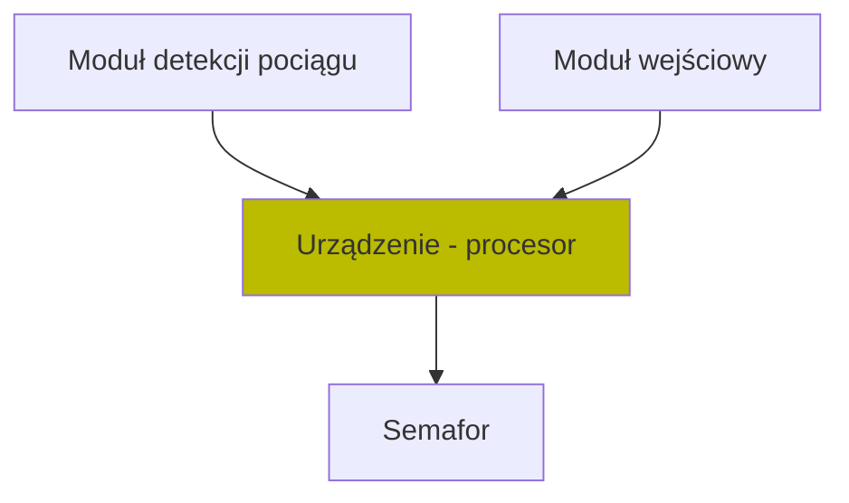
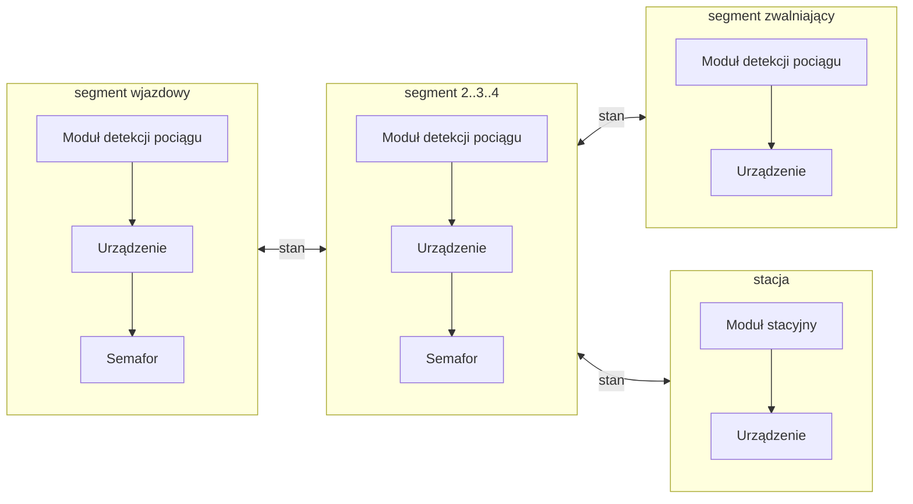
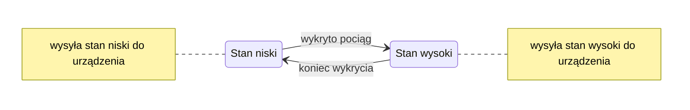

# blocking-line
**blocking-line** jest projektem który ma umożliwić stworzenie standardu komunikacji i w konsekwencji **urządzenia**.

**Urządzenie** to ma na celu obsługę przysytanków odstępowych lub samoczynnej blokady liniowej

**Urządzenie** co do zasady ma być niezależne od sposobu detekcji pociagu

# Index
- [budowa modułowa](#budowa-modułowa)
  - [zewnętrzny moduł detekcji pociągu](#zewnętrzny-moduł-detekcji-pociągu)
  - [sterowanie zewnętrznym semaforem](#sterowanie-semaforem)
  - [moduł wejściowy do podłączenia na stacji](#moduł-wejściowy-stacji)
- [konfigurowalna możliwość pracy](#konfiguracje)
  - jako posterunek odstępowy
  - jako SBL (2-3-4 stawna)
- [Elementy do przemyślenia](#elementy-do-przemyślenia)

 ## Budowa modułowa

Poprzez **moduły** rozumiemy zewnętrzne układy (podprogramy), których wykonują szczególne zadania.

Schodząc do poziomu **urządzenia**, moduł będzie komunikował się używając stanów logicznych procesora.

 

#### Przykładowa implementacja odcinka

Na wykresie przedstawiono przykładowy odcinek chroniony

**Segment wjazdowy** odpowiada za pracę semafora podłączonego do swojego **urządzenia**.

**Segmenty 2..3..4** odpowiadają zarówno za pracę *swojego* semafora, ale również przesyła informację o 
swoim stanie do poprzedzającego go segmentu.

**Segment zwalniający** segment nie posiada semafora a jego rolę jest wykrycie opuszczenia chronionego odcinka.
przesyła ingformację "droga wolna". 
(wykorzystanie tej konfiguracji nie występuje w rzeczywistości, ale może ułatwić sterowanie ruchem)

**Stacja** odpowiada za komunikację i odpowiednie wyświetlenie sygnałów na poprzedzających segmentach. [Zobacz](#moduł-wejściowy-stacji)

### Zewnętrzny moduł detekcji pociągu

Poprzez ten moduł rozumiemy układ elektroniczny (lub podprogram), który podczas swojej pracy 
potrafi wykryć przejazd pociągu na odcinku, który obsługuje.

Możliwe implementacje:
- [poprzez sprawdzenie poboru prądu na odcinku](#sprawdzanie-poboru-prądu)
  - czujnik poboru prądu efekt Halla [np. tutaj](https://elektronikab2b.pl/technika/27823-czujniki-do-pomiaru-pradu-z-efektem-halla)
  - czujnik przekładnik prądowy [artykuł](http://thenscaler.com/?p=1080), [moduł](https://www.gotronik.pl/detektor-czujnik-pradu-ac-do-5a-ac-p-6330.html)
- poprzez sprawdzenie przejazdu nad odcinkiem
  - czujnik światła (fotorezystory)
  - aktywny czujnik podczerwieni (PIR)
  - czujnik zbliżeniowy 

Moduł detekcji pociągu - powiadamia **urządzenie** o fakcie wykrycia pociągu poprzez podanie stanu. 
Utrzymuje stan cały czas gdy pociąg jest wykrywany. 
Wszelkie niedoskonałości wykrywania można filtrować filtrami dolnoprzepustowymi.

#### Sprawdzanie poboru prądu 
Polega na sprawdzeniu czy na odcinku torowiska pobierany jest prąd.

Sprawdzanie poboru prądu nie jest najlepszym sposobem wykrywania pociągu.

Na testowanym odcinku wykrywane są tylko elementy taboru pobierające prąd.

>Przykład 1: Przejazd pociągu towarowego:
>
>Pociąg może się zatrzymać i częścią składu stać na odcinku testowanym, a mimo to nie jest wykrywany.

>Przykład 2: Przejazd pociągu osobowego z oświetlonym ostatnim wagonem:
>
>Po przejeździe lokomotywy następuje chwila gdy przejeżdżają wagony nieoświetlone. 
Wjazd oświetlonego wagonu powoduje nowe wykrycie. 
Nie ma możliwości wykrycia czy to nowy pociąg, czy część przejeżdzającego składu.

### Sterowanie semaforem
Poprzez moduł sterowania semaforem rozumiemy możliwość podłączenia semafora do **urządzenia**. 
Wyjścia programowalne ustawiają stany używane do zapalania poszczególnych świateł w komorach semafora.

Sterowania semaforem są różne - prąd zmienny, stały oraz różne wartości napięcia.

*Temat wymaga dyskusji.*
### Moduł wejściowy stacji

W rzeczywistych implementacjach sygnały wyświetlane na semaforach zależą od sygnałów wyświetlanych 
na semaforze wjazdowym na stacji.

Żeby dobrze zamodelować rzeczywistość przewidujemy moduł do użycia na stacji.

Moduł taki można zintegrować ze stacją (wewnątrz pulpitu - wymaga ingerencji w stację),
albo wykonać zewnętrzną implementację, na której obsługa stacji powtarzałaby sygnał semafora wjazdowego.

 
**Urządzenie** po podłączeniu modułu wejściowego nie musi wykrywać pociągu, 
Jego stan polegałby na ustawieniu sygnału przez obsługę stacji.

*Temat wymaga dyskusji.*

## Konfiguracje

**Urządzenie** musi mieć możliwość konfiguracji. 

Kilka **urządzeń** tworzy odcinek chroniony. Odcinków chronionych może być wiele. 

Następujące parametry muszą być konfigurowalne:
- przynależność do odcinka chronionego
- kolejność na odcinku chronionym
- tryb pracy (jakie moduły są podłączone)

## Elementy do przemyślenia

Procesor (na tę chwilę jest pomysł Node MCU)

Język programowania

Medium (WiFi, Mesh, przewody)

Jak rozwiązać [sterowanie semaforem](#sterowanie-semaforem)

Jak podłączyć [moduł wejściowy stacji](#moduł-wejściowy-stacji)

Autoryzacja (ochrona ustawień **urządzenia** przed przypadkową zmianą)

Praca jednego **urządzenia** na segmencie dwutorowym 
